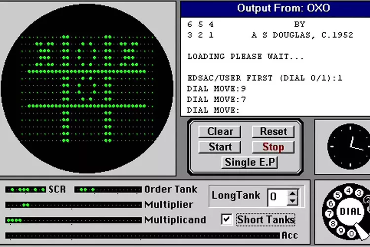

```{r}
#| echo: false
#| eval: true
#| output: false
#| label: Loading R-Libraries
#install.packages(c("DiagrammeR", "reticulate", "kableExtra", "tidyverse", "knitr", "cowplot", "ggfx"))
library("DiagrammeR")
library("reticulate")
library("kableExtra")
library("tidyverse")
library("knitr")
library("cowplot")
library("ggfx")
knitr::opts_chunk$set(echo = FALSE)
use_condaenv("IASP", required = TRUE)

def.chunk.hook <- knitr::knit_hooks$get("chunk")
knitr::knit_hooks$set(chunk = function(x, options) {
    x <- def.chunk.hook(x, options)
    ifelse(options$size != "normalsize", paste0("\n \\", options$size, "\n\n", x, "\n\n \\normalsize"), x)
})
```

```{python}
#| echo: false
#| eval: true
#| output: false
#| label: Loading Python-Libraries

import numpy as np
import cv2
import matplotlib.pyplot as plt

def adjust_gamma(image, gamma=1.0):
   invGamma = 1.0 / gamma
   table = np.array([((i / 255.0) ** invGamma) * 255
      for i in np.arange(0, 256)]).astype("uint8")
   return cv2.LUT(image, table)

def mostrarImagen(imagen):
    fig = plt.imshow(imagen)
    plt.axis("off")
    plt.show
```

# Conceptos básicos

# ¿Qué es una Imagen Digital?

## Definición
- **Imagen Digital:** Una imagen digital es una representación bidimensional de una escena o objeto real, creada a partir de un conjunto de datos numéricos que se almacenan y procesan electrónicamente.

```{python}
#| echo: false
#| eval: true
#| output: true
#| label: Imagen Digital
#| fig-align: center

imagen = cv2.imread("images/deadpool.png")
imagen = cv2.cvtColor(imagen, cv2.COLOR_BGR2RGB)
mostrarImagen(imagen)
```

## Tipos de Imágenes Digitales

::::{.columns}

::: {.column width='50%'}
**Raster (Bitmap):** Formadas por una matriz de píxeles.

**Algunos Formatos:** BMP, JPEG, PNG, GIF
:::

::: {.column width='50%'}
**Vectoriales:** Formadas por ecuaciones matemáticas y gráficos vectoriales.

**Algunos Formatos:** SVG, EPS, CDR, AI, PDF
:::
::::

## Componentes
- **Píxeles:** La unidad más pequeña de una imagen digital, cada píxel contiene información de color y brillo.
- **Resolución:** La cantidad de píxeles en una imagen, comúnmente expresada como el número de píxeles horizontales por verticales (por ejemplo, 1920x1080).

::::{.columns}

::: {.column width='50%'}

```{python}
#| echo: false
#| eval: true
#| output: true
#| label: pixeles
#| fig-align: center

mostrarImagen(imagen)

```


:::

::: {.column width='50%'}
```{python}
#| echo: false
#| eval: true
#| output: true
#| label: pixeles 2
#| fig-align: center
(numfilas, numcolumnas, numcanales) = imagen.shape
print(f"La resolución de la imagen es: {numcolumnas}x{numfilas}")
print(f"El número de canales que tiene la imagen es: {numcanales}")

```
:::
::::

## Componentes
- **Píxeles:** La unidad más pequeña de una imagen digital, cada píxel contiene información de color y brillo.
- **Resolución:** La cantidad de píxeles en una imagen, comúnmente expresada como el número de píxeles horizontales por verticales (por ejemplo, 1920x1080).

::::{.columns}

::: {.column width='50%'}

```{python}
#| echo: false
#| eval: true
#| output: true
#| label: pixeles 3
#| fig-align: center

mostrarImagen(imagen)

```


:::

::: {.column width='50%'}
```{python}
#| echo: false
#| eval: true
#| output: true
#| label: pixeles 4
#| fig-align: center
#| code-overflow: wrap

print(imagen[:,:,0])

```
:::
::::

---

## Representación Computacional de Imágenes
### Resolución y Dimensiones
- **Definición de resolución**
  - Número de píxeles por unidad de área, generalmente píxeles por pulgada (PPI).
- **Relación entre resolución y calidad**
  - A mayor resolución, mayor calidad y detalle de la imagen.

---

## Representación Computacional de Imágenes
### Compresión de Imágenes
- **Compresión sin pérdida**
  - Mantiene toda la información original (ej. PNG).
- **Compresión con pérdida**
  - Elimina parte de la información para reducir tamaño (ej. JPEG).
- **Algoritmos comunes**
  - Run-length encoding, DCT para JPEG.

---

## Teoría del Color
### Modelos de Color
- **RGB (Rojo, Verde, Azul)**
  - Modelo aditivo usado en pantallas.
- **CMYK (Cian, Magenta, Amarillo, Negro)**
  - Modelo sustractivo usado en impresión.
- **HSL (Tono, Saturación, Luminosidad)**
  - Basado en percepción humana del color.
- **YUV**
  - Separación de luminancia y crominancia, usado en video.

---

## Teoría del Color
### Percepción del Color
- **Cómo percibimos el color**
  - El ojo humano detecta la luz a través de conos sensibles a diferentes longitudes de onda.
- **Influencia de la luz y el entorno**
  - La percepción del color puede variar según la iluminación y el contexto.

---

## Teoría del Color
### Espacios de Color
- **Definición y propósito**
  - Espacios matemáticos que describen cómo se representan los colores.
- **Ejemplos de espacios de color**
  - sRGB: Estándar para la web.
  - Adobe RGB: Mayor gama de colores, usado en fotografía.


# Una época de las maravillas

## Que conocieron mis papás


## Que conocieron mis papás
